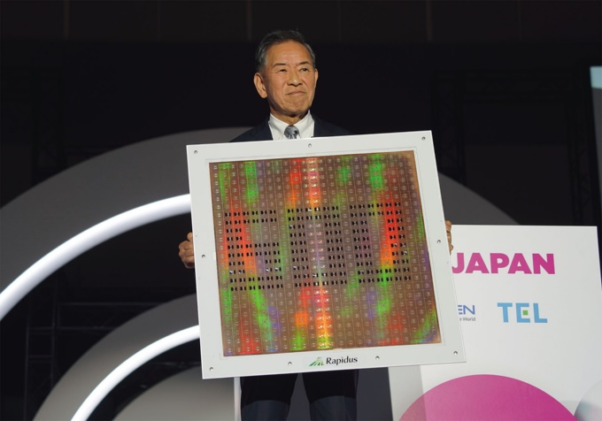

<!-- _class: lead -->
# FS3.0報告

佐藤雅之
2026/2/26

---
# 令和7年度の取組・成果: プロセスノード微細化技術に関する調査

## 技術の概要

プロセスノード微細化はスーパーコンピュータ性能向上の基盤技術。演算密度の向上により1ノードあたりの性能が飛躍、電力効率（FLOPS/W）の改善によりゼタスケール実現への道を開く。また，オンチップキャッシュ容量の増大で実効性能向上が期待できる．

## 2026年現在：主要ファウンダリの技術競争

- TSMC（台湾）：2nm（N2）量産開始（2025年Q4）、初のGAA採用、（Apple、NVIDIA等が生産能力を確保）
- Samsung（韓国）：GAA技術先行導入（2022年）、2nm（SF2）量産（2025年Q4）、TSMCの需要逼迫により各社が移行を検討中，1.4nm（SF1.4）量産（2029年予定）
- Intel（アメリカ）：18A生産開始（2025年4月）、RibbonFET（GAA）＋PowerVia（バックサイド電源）で差別化，自社CPU採用が主
- Rapidus（日本）：IBM技術提携により2nm試作成功（2025年7月）、2nm量産開始（2027年後半予定）、1.4nm計画（2029-2030年予定），富士通やTenstorrentが顧客候補

## 2030年代の見込み

- さらなる微細化によるAngstrom世代（1nm以下）への突入
- 新材料・新構造による微細化限界と静的電力の克服

---

# 令和7年度の取組・成果: チップレットアーキテクチャ・接続技術に関する調査

## 技術の概要

微細化限界を突破し性能とコストを両立する技術。モノリシック構成から分割構成による製造歩留まりの向上や，異種プロセス技術によるチップを混在させる設計柔軟性により，コスト最適化が可能．結果としてシステム性能の向上が可能。

## 2026年現在：主なチップレットアーキテクチャや接続技術の概観

チップレット構成
- AMD EPYC Turin：最大192コア（3nm）をIOダイ（4nm）と接続
- Intel：Sapphire Rapids（4分割チップレット構成），Emerald Rapids（2分割）
- Apple Ultraシリーズ：2つのMAX CPUチップを接続

チップレット接続技術
- Intel EMIB：2.5D接続、第2世代でマイクロバンプピッチ55μm→45μmに微細化
- TSMC InFO_LI：ローカルシリコンインターコネクト、Apple Ultraシリーズで採用
- AMD Infinity Fabric：専用高速インターコネクト、チップレット間高帯域接続
- UCIe標準化：100社程度が参加、2026-2028年商用展開
- Ayar Labs光インターコネクト：世界初光チップレット接続技術

---

# 令和7年度の取組・成果: チップレットアーキテクチャ・接続技術に関する調査 cont.

## 2030年代の見込み

- チップレット間光接続実用化
- UCIeエコシステムで市場形成（Intel/AMDは独自路線か？）

---

# 令和7年度の取組・成果: 光電融合技術

## 技術の概要

通信媒体を電気から光に変えることにより，帯域幅増加・レイテンシ削減・消費電力削減等が期待される．特に並列化されたプログラムの性能と効率の向上に繋がることが期待される．

## 2026年現在：光電融合技術の概観

### CPO
- Broadcom：CPOによるイーサネットスイッチTomahawk 6-Davisson（102.4Tbps）世界初量産
- NVIDIA：TSMCのCOUPE技術でパッケージ内光変換統合（Quantum-X InfiniBand/Spectrum-X）
- Intel：Optical Chip Interconnectプラットフォームで垂直統合（2028年頃）
### 光ネットワーク：
- 主要3社（Innolight、Coherent、Eoptolink）が供給
- 800G Ethernet：2024年頃から展開、AIデータセンターでは標準
- 1.6T Ethernet：2025年頃から開始、OSFP-XD，ハイパースケーラが積極的に採用

---

# 令和7年度の取組・成果: 光電融合技術 cont.

## 2030年代の見込み
- チップ内光インターコネクト量産化、光電融合プロセッサ実用化
- 100Tbps級光スイッチング，10Tbps Ethernet以上（25Tbps、51Tbps）標準化
- 空間光通信無線光リンク、チップレット間光接続実装

---

# Rapidusチップレット技術: 1600mm角ガラス基板を使った大型インターポーザ

## 概要

- 600mm × 600mm の四角ガラス基板を用いた大型再配線インターポーザのプロトタイプを実証
- 量産性・面積効率・配線密度の観点で従来のシリコンインターポーザとは一線を画す可能性有
- 同社の前後工程融合戦略の中核となる技術として注目を集める

## インターポーザとは？

- 複数の半導体チップ（例：CPU/GPU/HBMメモリ等）を接続するための中間基板
- インターポーザ上に再配線層（RDL, Redistribution Layerを形成し，チップ間を配線）

---
# Rapidusチップレット技術: 1600mm角ガラス基板を使った大型インターポーザ cont.

## Rapidusのインターポーザ技術の特徴

### ガラス基板
- 大きくて安い
  - cf. シリコンは単結晶の高価な材料であり，特に大面積化するほどコストが増大
- 熱やプロセス中の変形が少ない
  - cf. 有機基盤では熱膨張の問題で微細配線が困難
- 表面が非常に平滑で硬い

### 600mm角形パネル
- 従来の300mm円形シリコンウエハーと比べてインターポーザ製造の面積効率が大幅に向上
  - 一枚の600mm四角パネルから取り出せる数は、300mm円形と比べて約10倍

---
# Rapidusチップレット技術: 1600mm角ガラス基板を使った大型インターポーザ cont.

SEMICON Japan 2025にてRapidus小池社長が掲げた600mm角形インターポーザ

--- 
# Rapidusチップレット技術: 1600mm角ガラス基板を使った大型インターポーザ cont.

## 将来展望
- 将来的にはガラスに微細な穴を開け電極を通す「TGV（Through Glass Via）」技術を用いてインターポーザ基板とする．
  - TGV無しでも高密度チップレット接続は可能
  - シリコンインターポーザにとってかわるためには外部I/Oの高速化のためにTGVは必須（スパコンにはこれも必要）
- 自社内で先端ロジック（2nm）と後工程（この大型インターポーザを含む先端パッケージング）を同時に最適化する「前後工程融合戦略」の中核技術

### 参考文献
- "Rapidus、600mm角インターポーザーパネルを初披露　NVIDIAの受託にも意欲," EE Times Japan, 2025/12/19.
- "ラピダス小池社長、世界初600mm角基板を披露　未来の半導体工場構想も," TECH+(マイナビニュース), 2025/12/24.